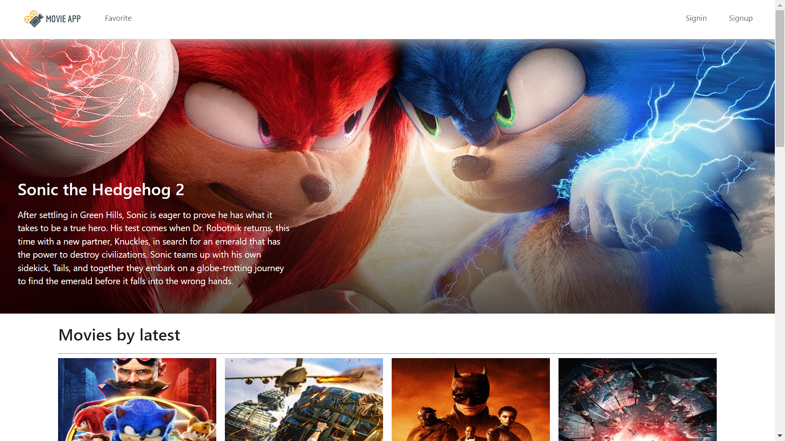
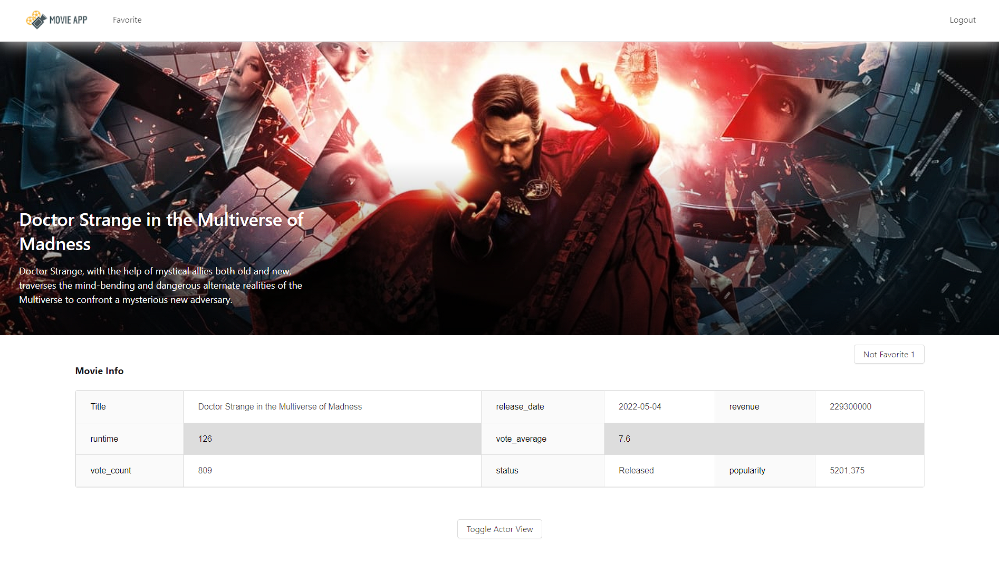
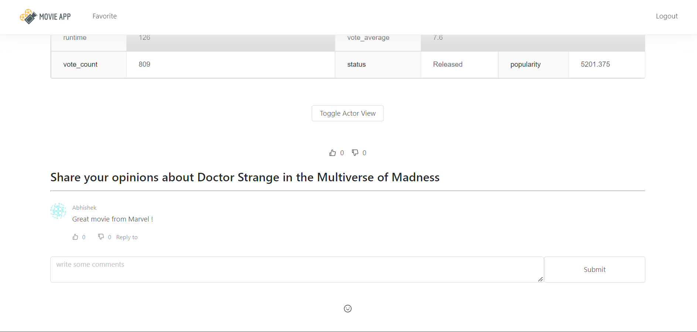
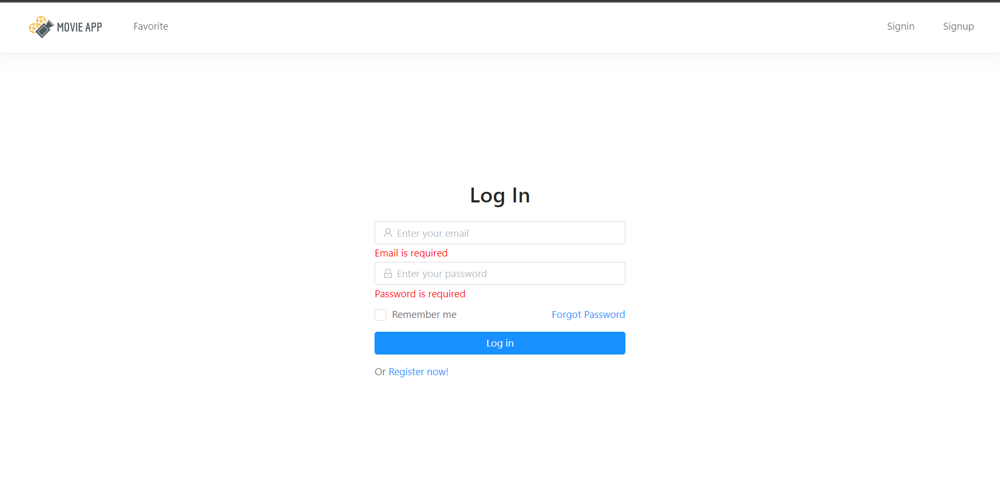
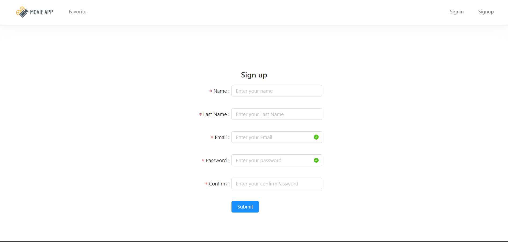

<h1 align="center">
🌐 The Movie Database App
</h1>

## Description

This project aims to allow users to see details like reviews, ratings, information about actors starring in the movie, IMDB rating among other information fetched using The Movie Database API.

## Table of Contents

- [Features](#🚀-features)
- [Tech Stack](#🖥️-tech-stack)
- [Getting Started](#getting-started)
- [Dependencies](#dependencies)
- [File Structure](#file-structure)
- [Demo Screenshot](#demo-screenshot)

### Built With

- [The Movie Database (TMDB) API](https://www.themoviedb.org/) -This API service is for those interested in using movie, TV show or actor images and/or data in your application. This API is a system that provides programmatically to fetch and use the data and/or images.

## 🚀 Features

User once has registered and logged in can perform these various actions :-

- Add/Remove movies from watchlist
- Add/Remove movies from favourites
- Like/Dislike movies
- Comment under movies
- Reply to other comments

## 🖥️ Tech Stack

**Frontend:**

&nbsp;

- Used for its easy creation of dynamic applications, it's performance edge like virtual DOM, reuseable components and unidirectional data flow.

&nbsp;

- Enabled the navigation among views of various components in a React Application, allows changing the browser URL, and keeps the UI in sync with the URL.

 &nbsp;

- An enterprise-class UI design language and React UI library with a set of high-quality React components, one of best React UI library for enterprises.

**Backend:**

&nbsp;

- The JavaScript runtime environment. It is used to run JavaScript on a machine rather than in a browser.

&nbsp;

- A framework layered on top of NodeJS, used to build the backend of a site using NodeJS functions and structures. Since NodeJS was not developed to make websites but rather run JavaScript on a machine, ExpressJS was developed.

&nbsp;

- Used because of its flexible schema makes it easy to evolve and store data in a way that is easy to work with. MongoDB is also built to scale up quickly and supports all the main features of modern databases such as transactions.

## Getting Started

#### _**IMPORTANT NOTE**_ -

This project does not have a mongoDB connection setup. Setup the connection based on the environments below.

- Local Development: Create a dev file (make sure to name it dev.js) in the config folder, which exports your db.uri connection.
- Production: Since the config file is not pushed when you deploy your app, you must specifiy your db uri in heorku. Set the uri in heroku as specified in [this](https://devcenter.heroku.com/articles/config-vars) resource. Make sure you name the environement variable "DB_URI".

### Clone

```terminal
$ git clone https://github.com/Abhishek172/movie-app.git
```

## Run on your machine

### Prerequisites

- [MongoDB](https://gist.github.com/nrollr/9f523ae17ecdbb50311980503409aeb3)
- [Node](https://nodejs.org/en/download/) ^10.0.0
- [npm](https://nodejs.org/en/download/package-manager/)

You need client and server runs concurrently in different terminal session, in order to make them talk to each other

Once in Project folder

### Client-side usage(PORT: 3000)

```terminal
$ cd client
$ npm i
$ npm start
```

### Server-side usage

```terminal
$ npm i
$ cd server
$ nodemon index.js
```

### Dependencies

| Client-side              | Server-side           |
| ------------------------ | --------------------- |
| antd: ^3.24.1            | bcrypt: ^5.0.1        |
| axios: ^0.18.0           | body-parser: ^1.18.3  |
| formik: ^1.5.8           | cookie-parser: ^1.4.3 |
| moment: ^2.24.0          | express: ^4.17.1      |
| react: ^16.8.6           | jsonwebtoken: ^8.5.1  |
| react-dom: ^16.8.6       | mongoose: ^5.4.20     |
| react-dropzone: ^10.2.1  | react-redux: ^5.0.7   |
| react-icons: ^3.7.0      | socket.io: ^2.2.0     |
| react-redux: ^7.1.0-rc.1 |
| react-router-dom: ^5.0.1 |
| react-scripts: 3.0.1     |
| redux: ^4.0.0            |
| redux-form: ^8.2.6       |
| redux-promise: ^0.6.0    |
| redux-thunk: ^2.3.0      |
| socket.io-client: ^2.2.0 |
| yup: ^0.27.0             |

## File Structure

#### `client` - Holds the client application

- #### `public` - This holds all of our static files
- #### `src`
  - #### `assets` - This folder holds assets such as images, docs, and fonts
  - #### `components` - This folder holds all of the different components that will make up our views
  - #### `views` - These represent a unique page on the website i.e. Home or About. These are still normal react components.
  - #### `App.js` - This is what renders all of our browser routes and different views
  - #### `index.js` - This is what renders the react app by rendering App.js, should not change
- #### `package.json` - Defines npm behaviors and packages for the client

#### `server` - Holds the server application

- #### `config` - This holds our configuration files, like mongoDB uri
- #### `controllers` - These hold all of the callback functions that each route will call
- #### `models` - This holds all of our data models
- #### `routes` - This holds all of our HTTP to URL path associations for each unique url
- #### `tests` - This holds all of our server tests that we have defined
- #### `server.js` - Defines npm behaviors and packages for the client

#### `package.json` - Defines npm behaviors like the scripts defined in the next section of the README

#### `.gitignore` - Tells git which files to ignore

#### `README` - This file!

## Demo Screenshot



<table>
    <tr>
        <td></td>
        <td></td>
    </tr>
    <tr>
        <td></td>
        <td></td>
    </tr>

</table>
